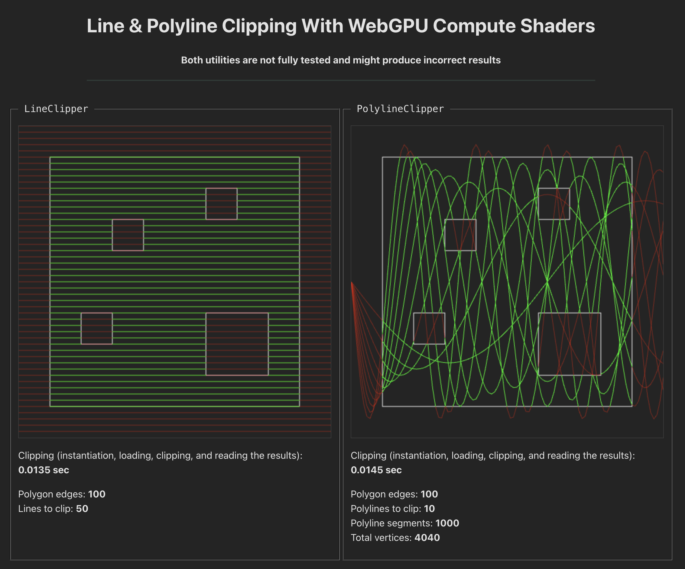

# webgpu-clip (POC)



Clipping lines and polylines is especially useful in pen plotter art, where, if you want to fill a shape with color, you need to hatch it with lines. In other words: to create a bunch of lines covering the bounding box of a polygon, and then to clip them.

Clipping lines and polylines on CPU is feasible, but might be slow, especially when having many shapes to fill. That's why I created this POC.

This repository contains 2 utility classes, one for clipping lines (2-points long arrays), which is useful for fast shape filling with color. The second one is for complex polylines, such as patterns that intersect given shape.

**Both utilities are not fully tested and might produce incorrect results**

Edge cases like curved (spirals) or really complex polygons with hundreds of edges are not well handled yet.

### Line clipping

```ts
const polygon = [
  /* a polygon as a bunch of rings filled with points in { X: number, Y: number } format */
];

const lines = [
  [{ X: 10, Y: 10 }, { 1000, 10 },]  /* etc. */
];

const device = await getGPUDevice();
const clipper = new LineClipper({ device, polygon });

const result = await clipper.lineClip(lines);
```

### Polyline clipping

```ts
const device = await getGPUDevice();

const polygon = [
  /* a polygon as a bunch of rings filled with points in { X: number, Y: number } format */
];
const polylines = [[
  { X: 10, Y: 10 },
  { X: 30, Y: 39 },
  { X: 21, Y: 37 } /* array of arrays of connected points */,
]];

const clipper = new PolylineClipper({ device, polygon })

const result = await clipper.clip(polylines));
```

### Point format

Point format (`{ X: number; Y: number; }`) is the same as the format of famous and briliant [Javascript Clipper library](https://sourceforge.net/p/jsclipper/wiki/documentation/).
